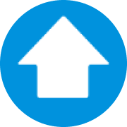
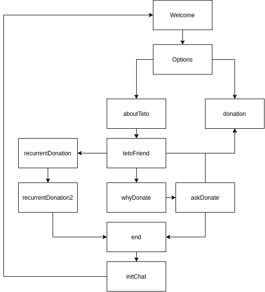

<p align="center">
  
</p>
<h1 align="center">
  Teto
</h1>

<!-- Badges -->
<p align="center">
  <!-- if your  -->
  <a href="https://github.com/gledson-ss/teto-solution/graphs/commit-activity" alt="Maintenance">
    
  </a>

  <!-- if your app is a website -->
  <a href="https://https://doe-teto.netlify.app/" alt="Website https://doe-teto.netlify.app/">
    
  </a>

  <!-- License -->
  <a href="./LICENSE" alt="License: MIT">
    
  </a>

  <!-- codefactor -->
  <a href="https://www.codefactor.io/repository/github/gledson-ss/teto-solution" alt="CodeFactor">
    
  </a>

  <!-- if your app is a website deployed on Netlify -->
  <a href="https://app.netlify.com/sites/<name>/deploys" alt="Netlify Status">
    /deploy-status" />
  </a>

  <br/>

  

  <!-- version -->
  

  <!-- GitHub repo size -->
  

  <!-- Social -->
  <a href="https://github.com/gledson-ss/teto-solution/stargazers">
    
  </a>

  <!-- more badges here -> https://gist.github.com/tterb/982ae14a9307b80117dbf49f624ce0e8 -->
</p>

<!-- summary -->
<p align="center">
  <a href="#clipboard-description">Description</a>&nbsp;&nbsp;&nbsp;|&nbsp;&nbsp;&nbsp;
  <a href="#rocket-getting-started">Getting Started</a>&nbsp;&nbsp;&nbsp;|&nbsp;&nbsp;&nbsp;
  <a href="#-whats-inside">What's inside?</a>&nbsp;&nbsp;&nbsp;|&nbsp;&nbsp;&nbsp;
  <a href="#memo-license">License</a>
</p>

## :clipboard: Description
A [TETO](https://www.techo.org/brasil/teto/) é uma ONG que atua na america latina ajudando a melhorar a vida de pessoas. Criando moradias e melhorando a infraestrutura de periferias construindo sedes comunitárias, pontes, quadras e biodigestores.

Pensando em ajudar, decidimos desenvolver uma aplicação que ajude uma pessoa a entender melhor o que é a TETO e poder ajudar fazendo uma doação.

O chatbot foi criado utilizando [React Simple Chatbot](https://lucasbassetti.com.br/react-simple-chatbot/), uma ferramenta que permite criar interações simples entre um usuário e o chatbot sem utilizar motores de reconhecimento de texto natural, evitando assim custos de manutenção desse tipo de ferramenta.  Todo o site foi desenvolvido em React e o chatbot pode, portanto, ser facilmente exportado como um componente e adicionado em qualquer site React.

Para testar a integração com o paypal utilize o e-mail de testes: `dreamteam@personal.example.com` e a senha `dreamteam`.

O funcionamento do chatbot TETO funciona de acordo com o fluxograma abaixo.



## :rocket: Getting Started

1. Download the repository

  - Using Git
```shell
  git clone https://github.com/gledson-ss/teto-solution.git
```
  - Using Github CLI
```shell
  gh repo clone gledson-ss/teto-solution
```
  > :bulb: or whichever way you prefer

2. Installation
  - Using `yarn`
   ```shell
   yarn
   ```
  - Using `npm`
   ```shell
   npm install
   ```

3. Execution
  - Using `yarn`

  ```shell
   yarn start
  ```
  - Using `npm`
   ```shell
   npm start
   ```

## 🧐 What's inside?

### :building_construction: Technologies
  - React
  - Integração com o Paypal
  - Typescript

### :lipstick: Linter tools
  - [ESLint](https://eslint.org/)


### :package: Packages
  - [GSAP](https://www.npmjs.com/package/react-gsap)
  - [react](https://www.npmjs.com/package/react)
  - [react-dom](https://www.npmjs.com/package/react-dom)
  - [react-modal](https://www.npmjs.com/package/react-modal)
  - [react-simple-chatbot](https://www.npmjs.com/package/react-simple-chatbot)
  - [styled-components](https://www.npmjs.com/package/styled-components)
  - [react-icons](https://www.npmjs.com/package/react-icons)


## :memo: License

This project is under the MIT license. See the file [LICENSE](LICENSE) for more details.

---

Build with 💙 By [Dream Team](https://github.com/henry-ns/mountbot/wiki/Authors)

Based on the [readme template](https://gist.github.com/henry-ns/a00234378353d9ca43e1bfe043202192) by [Henrique Miranda](http://thehenry.dev/)
